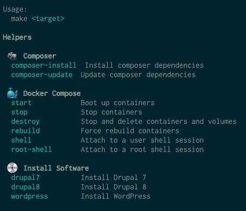

# A LAMP environment using docker
A few scripts to have a LAMP environment with docker in a **really easy** way.

Features
========
  - A LAMP environment running in just one command (Apache 2.4 - PHP 7.1 - MySQL 5.5)
  - Prepared to have as many containers as you want (usually one per project)
  - Composer installed
  - XDebug installed
  - [Mailhog](https://github.com/mailhog/MailHog) installed for working with emails locally

How to use
=========

There is a Makefile that allow you to perform the next actions:

## help
Will show a help similar to this:

## start  
This action has to be executed everytime that you want to start LAMP.

## stop
This action should be executed everytime that you finish working with LAMP.
 
## destroy  
This action is auxiliary, just in case you want to remove your LAMP environment. **By executing this action the database data will be removed**
 
## rebuild
This action destroy and start again all the environment

## shell
You can access to the bash by executing this action

## root-shell
You can access to the bash as a the **root user** by executing this

First time workflow
=======
  - Do clone that repo and give to the repo folder a name related with your project.
  - Execute the `make start` command to initialize your environment
  - Go to http://localhost and you should see a sucessful message
  - Remove the www/index.html and place all your project's files in the folder www/

Now you have your environment ready! Just remember to execute `make stop` when you finish.

Normal workflow
======

  * Execute `make start` to start LAMP
  * When you finish working execute `make stop`

Install additional software
==========

  - You can install Drush + Drupal 7 by executing `make drupal7`
  - You can install Drush + Drupal 8 by executing `make drupal8`
  - You can install WP CLI + Wordpress by executing `make wordpress`

Composer
========

You can use composer via the makefile too:

## composer-install
Install all the dependencies

## composer-update
Update all the dependencies

## composer CMD="command"
Execute any composer command you want, for example: `make composer CMD="require --dev phpunit/phpunit"` will install PHPUnit as development dependency.

Notes
======

  - The database server host is not 'localhost'. Use 'db' instead of 'localhost'.
  - The database user is 'root' and the password is '123'
  - You can access to Mailhog in http://localhost:8025
